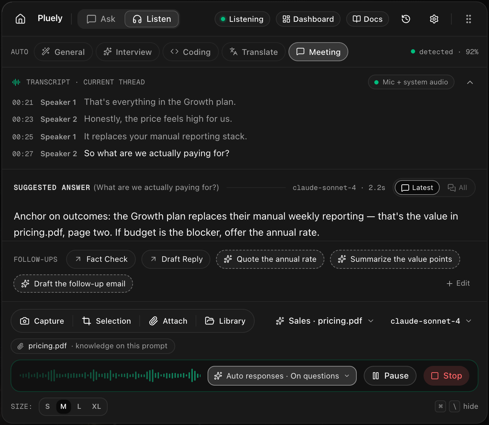
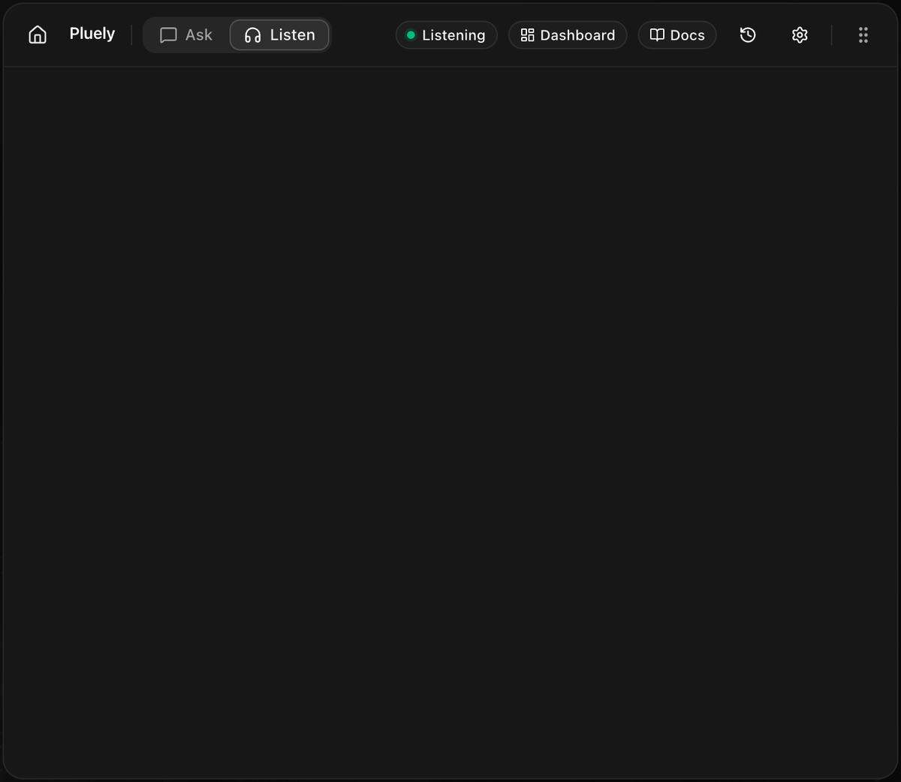
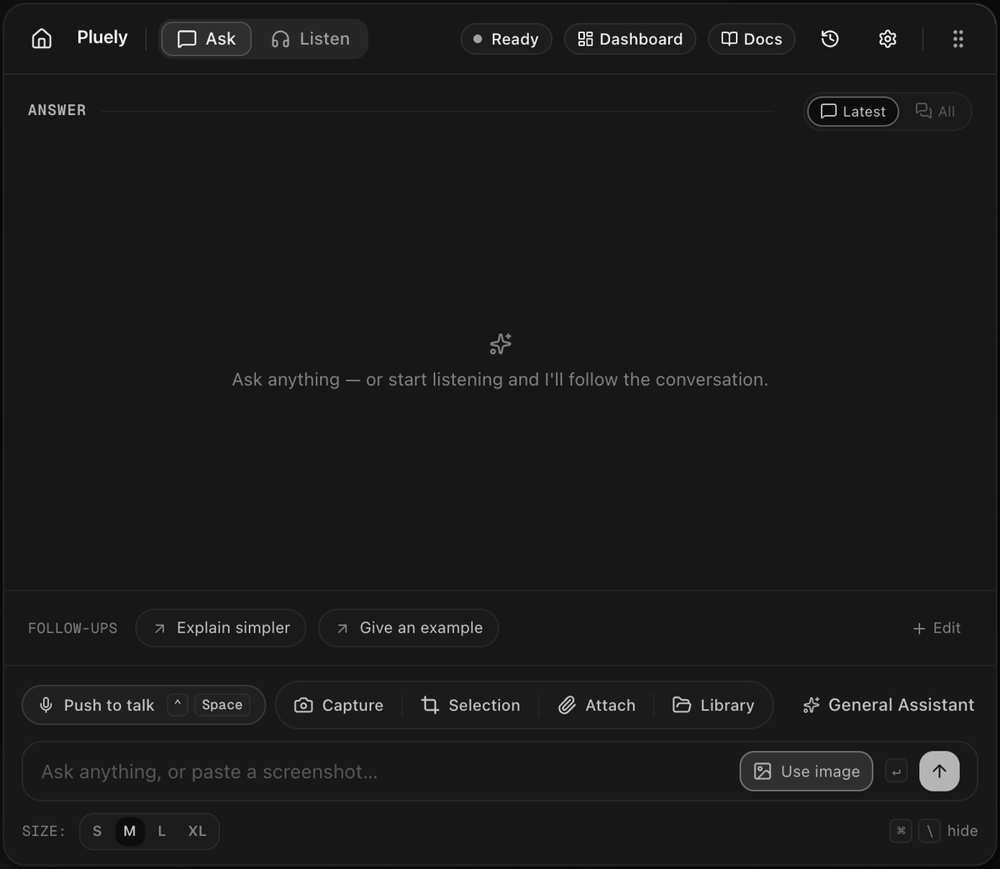

<div align="center">

# Pluely 🚀

**One overlay. No tab. No trace.**  
*The lightning-fast, privacy-first AI assistant for live interviews, meetings, coding sessions, and everyday desktop workflows.*

[](https://pluely.com/)
[](https://docs.pluely.com)
[](https://pluely.com/download)

<br />

<a href="https://pluely.com/">
  
</a>

<p align="center"><i>The floating translucent overlay in Listen mode. Completely invisible on screen shares and recordings.</i></p>

---

[](https://pluely.com/download)
[](https://tauri.app/)
[](https://reactjs.org/)
[-003B57?style=flat&logo=sqlite&logoColor=white)](https://sqlite.org/)
[](LICENSE)

</div>

---

## 🌟 Why Pluely?

Pluely gives you an AI co-pilot directly over whatever you are doing—without switching browser tabs, breaking eye contact, or inviting awkward meeting bots.

Whether you're in a high-stakes technical interview, an executive presentation, a live client call, or a complex debugging session, Pluely stays discreetly within your line of sight with zero lag and zero trace.

<div align="center">

| 🕶️ **Real Screen Share Stealth** | ⚡ **Instant & Weightless** | 🧠 **Intelligent Adaptive AI** | 🔒 **100% Local & Private** |
| :--- | :--- | :--- | :--- |
| Excluded from screen capture via OS-native APIs (`WDA_EXCLUDEFROMCAPTURE`). Invisible on Zoom, Teams, Meet, and OBS. | Launches in <100ms. Tiny 9–16 MB installer. Runs with minimal CPU and RAM footprint. | Automatically routes answers into 3-tier code, substantive STAR stories, or system design deep dives. | Transcripts, chats, and API keys are stored in your local SQLite database. Never used for model training. |

</div>

---

## 📥 Downloads

<div align="center">

[-0078D4?style=for-the-badge&logo=windows&logoColor=white)](https://pluely.com/download/windows)
&nbsp;
[-000000?style=for-the-badge&logo=apple&logoColor=white)](https://pluely.com/download/macos)
&nbsp;
[-FCC624?style=for-the-badge&logo=linux&logoColor=black)](https://pluely.com/download/linux)

**Available Formats:** `.exe` (Standalone & Setup) • `.msi` • `.dmg` • `.deb` • `.AppImage`  
*Free forever core plan · No account required to start · Automatic silent updates*

</div>

---

## ✨ Key Features & Capabilities

### 1. 🎧 Dual-Channel Listen Mode
Listen mode captures both your **Microphone** and **System Audio** (call participants, meeting audio, interviewer voice) concurrently through low-latency native loopback—with zero bots joining the call.



- **Live Speaker Transcription**: Differentiates between what the speaker said and what you said.
- **Auto-Response Triggers**: Trigger AI suggestions on question detection, speech pauses, or on-demand shortcut click.
- **Smart Follow-Up Chips**: Dynamically generates 1-click relevant follow-up questions from the live transcript.

---

### 2. 🧠 Intelligent Auto-Adaptive Format Routing
Pluely automatically understands what kind of question is being asked and adapts the output structure dynamically:

- **💻 3-Tier Progressive Code** (`[💻 Code]`):
  - **Tier 1 — Brute Force**: Initial working approach and intuition.
  - **Tier 2 — Better / Optimized**: Intermediate improvements with data structure choices.
  - **Tier 3 — Most Optimal**: Production-grade solution with clean syntax, edge case handling, and exact $O(N)$ / $O(1)$ time and space complexity breakdown.
- **⭐ Substantive STAR Behavioral Answers** (`[⭐ STAR]`):
  - In-depth, articulate first-person narrative formatted into **Situation** (context & high stakes), **Task** (direct ownership & constraints), **Action** (concrete engineering steps, architectural trade-offs & obstacles overcome), and **Result** (quantifiable business metrics, latency drops, reliability improvements).
- **🔍 System Design Deep Dive** (`[🔍 Deep Dive]`):
  - Architecture breakdown, bottlenecks, trade-offs, scalability considerations, and component diagrams.
- **📋 High-Impact Talking Points** (`[📋 Bullets]`):
  - Rapid, punchy spoken bullets for immediate delivery under pressure.
- **✨ Auto Mode**: The AI automatically selects the best format, while interactive override chips allow switching formats instantly.

---

### 3. 🎯 Session-Specific System Prompts
Customize the AI's persona and context for each individual call without affecting global settings:

- Choose from any custom system prompt created in **Settings ➔ System Prompts** (e.g. *Senior Frontend Specialist*, *Staff System Architect*, *Behavioral Interview Coach*).
- Select your session prompt directly inside the **AI Configuration** settings panel or the **Candidate Context Modal**.
- Attach your resume, job description, or company background notes so every response aligns with your real experience.

---

### 4. 💬 Ask Mode & Visual Screen Intelligence
Ask mode lets you analyze whatever is visible on your screen with one keypress:



- **Instant Screen Capture**: Fullscreen, active window, or interactive region selection.
- **Built-in OCR & Vision**: Reads code snippets, diagrams, terminal errors, slide presentations, and PDFs.
- **Streaming Markdown**: Fast rendering with syntax highlighting, copyable code blocks, and keyboard navigation.

---

### 5. 🕶️ Stealth & Privacy Architecture
Pluely is built from the ground up for strict confidentiality:

- **Invisible to Screen Shares**: Built with Windows `WDA_EXCLUDEFROMCAPTURE` and macOS native panel APIs. Zoom, Google Meet, Teams, Discord, and screen recording software capture the windows behind Pluely, completely skipping the overlay.
- **Stealth Keystroke Mode**: Triggering shortcuts or summoning Pluely preserves active window focus, preventing your coding IDE, browser, or terminal from blinking or losing focus.
- **Local-First SQLite Database**: All transcripts, chat logs, custom prompts, and candidate context remain stored on your local disk (`pluely.db`).
- **Bring Your Own Keys (BYOK)**: Use 200+ hosted models or supply your own OpenAI, Anthropic, Gemini, Groq, DeepSeek, or local Ollama endpoints.

---

## ⌨️ Global Keyboard Shortcuts

| Action | Windows / Linux | macOS |
| :--- | :--- | :--- |
| **Summon / Hide Overlay** | <kbd>Ctrl</kbd> + <kbd>Space</kbd> | <kbd>Cmd</kbd> + <kbd>Space</kbd> |
| **Start / Stop Listen Mode** | <kbd>Ctrl</kbd> + <kbd>Shift</kbd> + <kbd>L</kbd> | <kbd>Cmd</kbd> + <kbd>Shift</kbd> + <kbd>L</kbd> |
| **Capture Screen & Attach** | <kbd>Ctrl</kbd> + <kbd>Shift</kbd> + <kbd>S</kbd> | <kbd>Cmd</kbd> + <kbd>Shift</kbd> + <kbd>S</kbd> |
| **Push to Talk** | <kbd>Ctrl</kbd> + <kbd>Shift</kbd> + <kbd>M</kbd> | <kbd>Cmd</kbd> + <kbd>Shift</kbd> + <kbd>M</kbd> |
| **Trigger Instant Suggestion** | <kbd>Ctrl</kbd> + <kbd>Enter</kbd> | <kbd>Cmd</kbd> + <kbd>Enter</kbd> |
| **Scroll Answers** | <kbd>J</kbd> / <kbd>K</kbd> or <kbd>↑</kbd> / <kbd>↓</kbd> | <kbd>J</kbd> / <kbd>K</kbd> or <kbd>↑</kbd> / <kbd>↓</kbd> |

*All shortcuts are fully customizable in Settings.*

---

## 🛠️ Development & Building from Source

### Prerequisites

- **Node.js** (v18 or higher) & **npm**
- **Rust** (stable toolchain via [rustup.rs](https://rustup.rs/))
- **Platform Dependencies**:
  - **Windows**: [Visual Studio C++ Build Tools](https://visualstudio.microsoft.com/visual-cpp-build-tools/) & WebView2 (included in Windows 10/11)
  - **macOS**: Xcode Command Line Tools (`xcode-select --install`)
  - **Linux**: WebKitGTK and development libraries (`libwebkit2gtk-4.1-dev`, `build-essential`, `curl`, `libssl-dev`)

### Installation & Local Run

```bash
# 1. Clone the repository
git clone https://github.com/iamsrikanthnani/pluely.git
cd pluely

# 2. Install frontend dependencies
npm install

# 3. Start the development server (launches Vite + Tauri dev overlay)
npm run tauri dev
```

### Packaging Production Binaries

```bash
# Compile and package standalone .exe / installers
npx tauri build
```

Generated binaries will be located under `src-tauri/target/release/` (`pluely.exe`, `bundle/nsis/`, `bundle/msi/`).

---

<div align="center">

**Crafted with ❤️ by [Rajkumar Pawar](https://www.srikanthnani.com/)**

[](https://x.com/Rajkuma83294456) &nbsp;
[](https://www.linkedin.com/in/rajkumarpawar0/) &nbsp;
[](https://rajkumarpawar07.github.io/)

</div>
